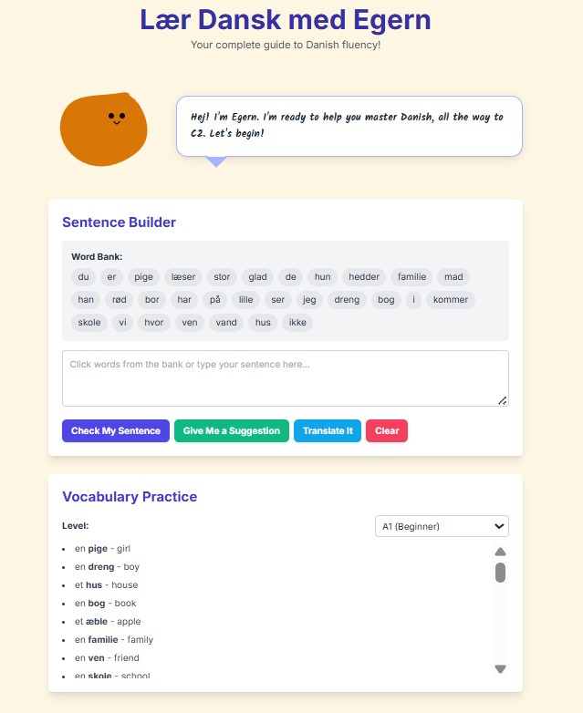

# Danish Language Tool

A web-based tool for learning Danish, designed to help users practice vocabulary, build sentences, and check basic grammar.

## Features

- **Sentence Builder:** Construct your own Danish sentences by typing or selecting words from a dynamically generated word bank.
- **Grammar Check:** Receive feedback on your sentence structure, including an introduction to the V2 (verb-second) rule.
- **Vocabulary Practice:** Browse and learn vocabulary words organized by CEFR levels (A1-C2).
- **Example Sentences:** Click on any vocabulary word to see a sample sentence demonstrating its usage.
- **Translation:** Get a simple word-for-word translation of your sentence.

## Screenshot

## How to Use

1.  **Select a Level:** Choose a proficiency level (A1 to C2) from the dropdown menu in the "Vocabulary Practice" section. The vocabulary and word bank will update accordingly.
2.  **Build a Sentence:** Click words from the word bank to add them to the input box, or type your own sentence directly.
3.  **Check Your Work:**
    - Click "Check My Sentence" for grammar feedback.
    - Click "Give Me a Suggestion" for a randomly generated sentence idea.
    - Click "Translate It" for a simple translation.
4.  **Learn Vocabulary:** Use the vocabulary list to see words, their English translations, and example sentences.

## Technical Details

-   HTML
-   CSS (via Tailwind CSS)
-   JavaScript

## Contributing

If you have suggestions for new features, vocabulary words, or bug fixes, feel free to open an issue or submit a pull request.